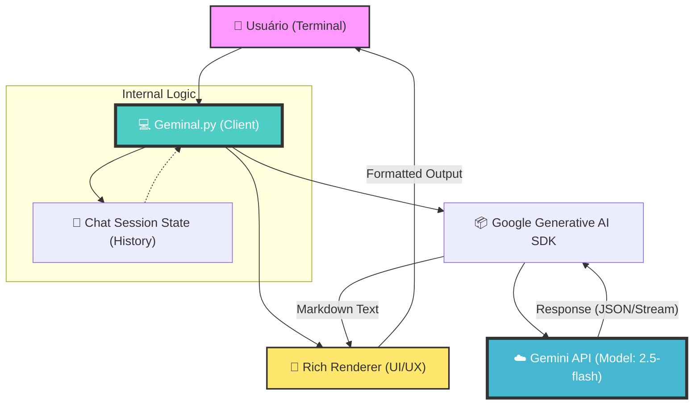

# Geminal: Interface de Terminal Avançada para Modelos Generativos Gemini

> "Convergindo a potência da inteligência artificial generativa de última geração com a eficiência e o minimalismo do ambiente de terminal."

## 📄 Abstract (Resumo Técnico)

O **Geminal** é uma implementação robusta de uma interface de linha de comando (CLI) projetada para facilitar a interação síncrona com os modelos de linguagem de grande escala (LLMs) da família Gemini, da Google DeepMind. O projeto aborda a necessidade de uma ferramenta de interação rápida e de baixo overhead para desenvolvedores e pesquisadores que buscam integrar capacidades cognitivas artificiais em seus fluxos de trabalho locais sem a necessidade de interfaces gráficas pesadas. 

A solução proposta utiliza a biblioteca `google-generativeai` para orquestração de diálogos e o framework `rich` para renderização avançada de texto e Markdown no terminal, garantindo que a saída da IA seja não apenas legível, mas estruturalmente organizada. A metodologia foca na simplicidade de implantação e na extensibilidade, permitindo que o usuário utilize o modelo `gemini-2.5-flash` (ou superiores) para tarefas que variam de depuração de código a geração de conteúdo complexo, mantendo a persistência de contexto durante a sessão de chat.

---

## 🛡️ Badges Abrangentes


---

## 🗺️ Sumário (Table of Contents)

1. [Introdução e Motivação](#-introdução-e-motivação)
2. [Arquitetura do Sistema](#-arquitetura-do-sistema)
3. [Decisões de Design Chave](#-decisões-de-design-chave)
4. [Funcionalidades Detalhadas](#-funcionalidades-detalhadas)
5. [Tech Stack Detalhado](#-tech-stack-detalhado)
6. [Estrutura do Código-Fonte](#-estrutura-do-código-fonte)
7. [Pré-requisitos Avançados](#-pré-requisitos-avançados)
8. [Guia de Instalação e Configuração](#-guia-de-instalação-e-configuração)
9. [Uso Avançado e Exemplos](#-uso-avançado-e-exemplos)
10. [Estratégia de Testes e Qualidade](#-estratégia-de-testes-e-qualidade)
11. [Deployment e Escalabilidade](#-deployment-e-escalabilidade)
12. [Contribuição](#-contribuição)
13. [Licença](#-licença)
14. [Equipe e Roadmap](#-equipe-e-roadmap)
15. [FAQ e Contato](#-faq-e-contato)

---

## 💡 Introdução e Motivação

No cenário contemporâneo de desenvolvimento de software, a integração de LLMs tornou-se um requisito para o aumento de produtividade. No entanto, muitas interfaces existentes sofrem de latência de rede em aplicações web pesadas ou carecem de suporte adequado para formatação de código no terminal. O **Geminal** surge para preencher essa lacuna, oferecendo uma ponte direta entre o terminal do desenvolvedor e o motor de inferência da Google.

A motivação central reside na criação de uma ferramenta que respeite a filosofia *Unix-like*: fazer uma coisa e fazê-la bem. O projeto minimiza a fricção entre a dúvida do desenvolvedor e a resposta da IA, utilizando uma arquitetura que prioriza a velocidade de resposta (através do modelo Flash) e a clareza visual.

---

## 🏗️ Arquitetura do Sistema

O Geminal opera sob uma arquitetura de cliente-servidor simplificada, onde o script local atua como um mediador de estado entre o usuário e a API Generativa da Google.



### Componentes:
- **Client (Geminal.py):** Gerencia o loop principal de eventos, captura de entrada e tratamento de exceções.
- **Session State:** Utiliza o método `start_chat` do SDK para manter o histórico de mensagens localmente, permitindo consultas contextuais.
- **Rich Renderer:** Transforma strings brutas em objetos `Markdown` e `Rule`, garantindo separação visual clara entre turnos de conversação.

---

## ⚖️ Decisões de Design Chave

1.  **Modelo `gemini-2.5-flash`:** Escolhido em detrimento do modelo `Pro` por sua latência significativamente menor e custo-benefício superior para interações rápidas via terminal.
2.  **Biblioteca Rich:** A decisão de utilizar `Rich` em vez de simples `print()` foi motivada pela necessidade de suporte a realce de sintaxe (syntax highlighting) em blocos de código gerados pela IA.
3.  **Chat History:** O histórico é mantido em memória durante a execução. Optou-se por não persistir em disco nesta versão inicial para garantir a privacidade dos dados por padrão.

---

## ✨ Funcionalidades Detalhadas

-   **Interação em Tempo Real:** Loop de leitura-avaliação-impressão (REPL) otimizado para baixa latência.
-   **Renderização de Markdown:** Suporte completo para tabelas, listas e blocos de código com realce de sintaxe diretamente no terminal.
-   **Gestão de Contexto:** O modelo lembra-se de mensagens anteriores na mesma sessão, permitindo refinamento iterativo de respostas.
-   **Tratamento de Erros Robusto:** Captura de exceções de rede e de API, evitando o fechamento inesperado da aplicação.
-   **Comandos de Saída:** Atalhos intuitivos (`sair`, `exit`, `quit`) para encerramento limpo da sessão.

---

## 🛠️ Tech Stack Detalhado

| Categoria | Tecnologia | Propósito |
| :--- | :--- | :--- |
| **Linguagem** | Python 3.10+ | Linguagem base para scripting e integração de IA. |
| **IA SDK** | `google-generativeai` | Interface oficial para comunicação com os modelos Gemini. |
| **UI/TUI** | `rich` | Renderização de texto rico, Markdown e spinners de carregamento. |
| **Networking** | `requests` / `urllib3` | Gerenciamento de requisições HTTP subjacentes. |
| **Protocolo** | gRPC / REST | Transporte de dados entre o cliente e os servidores da Google. |

---

## 📂 Estrutura do Código-Fonte

```text
Geminal-main/
├── Geminal.py           # Script principal contendo o loop da aplicação e lógica de IA.
├── requirements.txt     # Lista exaustiva de dependências e sub-dependências.
├── LICENSE              # Licença MIT (Direitos de uso e modificação).
├── .gitignore           # Definições de exclusão para Git (venv, caches, .env).
└── README.md            # Documentação técnica (este arquivo).
```

---

## 📋 Pré-requisitos Avançados

-   **Python 3.10 ou superior:** Necessário para suporte a tipagem moderna e compatibilidade com o SDK.
-   **Google AI API Key:** Uma chave válida obtida através do [Google AI Studio](https://aistudio.google.com/).
-   **Ambiente Virtual (Recomendado):** Para isolamento das dependências listadas no `requirements.txt`.

---

## 🚀 Guia de Instalação e Configuração

### 1. Clonagem do Repositório
```bash
git clone https://github.com/AndreIsraelAO/Geminal.git
cd Geminal
```

### 2. Preparação do Ambiente
```bash
python -m venv venv
source venv/bin/activate  # No Windows: venv\Scripts\activate
pip install -r requirements.txt
```

### 3. Configuração da API Key
Abra o arquivo `Geminal.py` e localize a variável `API_KEY`. Substitua pelo seu token:
```python
API_KEY = "SUA_CHAVE_AQUI"
```
*Nota: Em versões futuras, recomenda-se o uso de variáveis de ambiente (.env).*

### 4. Execução
```bash
python Geminal.py
```

---

## ⚙️ Uso Avançado e Exemplos

### Exemplo de Fluxo de Depuração:
**Usuário:** "Por que meu código Python abaixo está retornando um erro de indentação?"
**Geminal:** (Renderiza o código corrigido com realce de sintaxe e explica a regra da PEP 8).

### Uso para Geração de Documentação:
O Geminal pode ser usado para gerar esqueletos de documentos técnicos. Como ele renderiza Markdown, você pode copiar a saída formatada diretamente para seus arquivos `.md`.

---

## 🧪 Estratégia de Testes e Qualidade

Atualmente, o projeto foca em **Testes de Integração Manual**. A validação é realizada através de:
1.  Verificação de conectividade com os endpoints da Google.
2.  Validação de renderização de diferentes elementos Markdown (tabelas complexas, LaTeX).
3.  Testes de estresse de contexto (longas conversas para verificar limites de tokens).

---

## 🚢 Deployment e Escalabilidade

O Geminal é uma ferramenta de **lado do cliente (Client-side)**. Sua escalabilidade é inerente à infraestrutura da Google Cloud. Para uso em larga escala ou corporativo, recomenda-se a implementação de um sistema de rotação de chaves de API e a transição para o modelo `Gemini 1.5 Pro` caso a janela de contexto precise exceder 1 milhão de tokens.

---

## 🤝 Contribuição

Contribuições são o que tornam a comunidade de código aberto um lugar incrível para aprender, inspirar e criar.

1.  Faça um **Fork** do projeto.
2.  Crie sua **Feature Branch** (`git checkout -b feature/InovacaoIncrivel`).
3.  Faça o **Commit** de suas alterações (`git commit -m 'Add: Alguma funcionalidade'`).
4.  Faça o **Push** para a Branch (`git push origin feature/InovacaoIncrivel`).
5.  Abra um **Pull Request**.

---

## 📜 Licença

Distribuído sob a licença **MIT**. Veja o arquivo `LICENSE` para mais informações.

---

## 👥 Equipe Principal e Colaboradores

-   **AndreIsraelAO** - *Desenvolvedor Principal* - [GitHub](https://github.com/AndreIsraelAO)

---

## 🗺️ Roadmap Detalhado

- [ ] **Curto Prazo:** Implementar carregamento de API Key via arquivo `.env`.
- [ ] **Médio Prazo:** Adicionar suporte para envio de arquivos locais (RAG simplificado).
- [ ] **Longo Prazo:** Criar uma interface baseada em `Textual` para uma UI de terminal ainda mais imersiva.

---

## ❓ FAQ (Perguntas Frequentes)

**P: O Geminal armazena minhas conversas?**
R: Não. As conversas são mantidas apenas na memória volátil da sessão atual e enviadas para a API da Google para processamento.

**P: Como mudo o modelo para o Gemini Pro?**
R: No arquivo `Geminal.py`, altere a string `'gemini-2.5-flash'` para o modelo desejado disponível na sua conta.

---

## 📞 Contato e Suporte

-   **Issues:** [Reportar Bug ou Sugerir Feature](https://github.com/AndreIsraelAO/Geminal/issues)
-   **Repositório:** [https://github.com/AndreIsraelAO/Geminal](https://github.com/AndreIsraelAO/Geminal)
